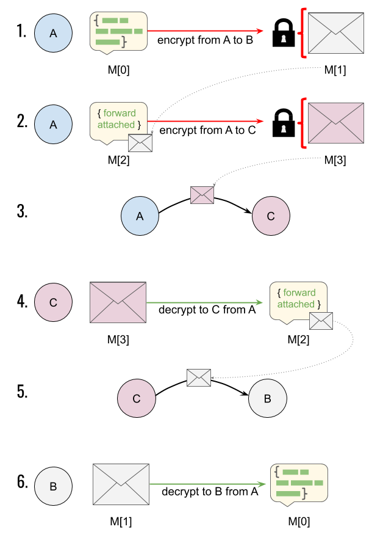

## Routing

__Routing__ is the process of managing the delivery of messages from sender to recipient, possibly adapting the packaging and transfer to intermediate nodes. A __route__ is a map or plan that specifies enough to achieve delivery in at least one direction; it may omit uninteresting details.

A __sender__ emits a message hoping that a __recipient__ eventually receives it. As a message moves toward the recipient, we say it is moving __destward__; the opposite direction is __sourceward__. Note that sender and recipient flip if a request-like message is followed by a response-like message in the opposite direction; the context that defines a sender is a single message, not a paired interaction. (DIDComm supports request-response but does not require it.)

We tend to conceive of senders and recipients as simple &mdash; "Alice" and "Bob" sound like unitary individuals. This can be a useful simplification. However, it's important to remember that it may hide important detail; if Bob uses a laptop, a mobile device, and a cloud service to receive messages, and if each of them follows the cryptographic best practice of not sharing keys, then it is impossible to ignore this complexity in some parts of routing design. We call the set of things that Bob controls his __sovereign domain__ (or __domain__ for short). Note that this usage is notably different from the meaning of "domain" in DNS and many web contexts. We also use the loose cover term __agent__ to refer to individual devices or pieces of software inside a given domain. The boundary of a domain is an important construct for trust analysis and for routing. We will explore this in greater detail below.

### Routing Requirements

All messaging technologies must address routing in some way. However, DIDComm has unusual requirements:

* Because of security and privacy goals, DIDComm routing must impose careful limits on how and to what degree intermediate nodes are trusted.

* Because DIDComm aims to be transport-independent, its routing model must be carefully decoupled from  strong assumptions about networking. In particular, DIDComm routing cannot make broad-brush assumptions that:
  * A given route will use only a single transport.
  * Transport mechanisms will provide any security benefits.
  * The identity and connectivity for every hop in a route will be known by any party at the time a message is sent.
  * The route from sender to recipient will be similar in hop identity, hop count, or transport mix to a complementary route from recipient back to sender.
  * All the nodes in a route are ever online at the same time.

* Because of decentralization and multiple-peer-friendly goals, DIDComm routing cannot orient itself around servers or simple request&mdash;response patterns as mandatory components.

* Because of privacy goals, DIDComm must offer fine distinctions in how repudiation and authentication are handled.

These requirements are very demanding. They do NOT necessarily make DIDComm hard to implement. They do NOT prevent DIDComm from using common web infrastructure &mdash; indeed, DIDComm routes quite simply and elegantly over HTTP. However, they DO force the routing model to be described in a very generic, flexible way, and they DO mean that existing routing solutions are an imperfect fit. DIDComm learns as much as it can, and borrows as much as it can, from clever and battle-tested routing work done in other contexts, but it does have some unique twists.

### Overview

Let's focus on a simple case where `A` wants to send a message to `B`, and the route involves one intermediate hop at `C`. Suppressing a few details, DIDComm routing works like this:

1. `A` prepares a plaintext message of any type, `M[0]`, and encrypts it for the recipient, `B`. This produces `M[1]`.
2. A prepares another plaintext message of type `forward`, and adds `M[1]` to it as an attachment. This new message, `M[2]`, asks `C` to to deliver the attached payload to `B`. `A` encrypts `M[2]` for `C`, producing `M[3]`.
3. `A` hands `M[3]` to `C`.
4. `C` decrypts `M[3]`, producing `M[2]`. Reading the plaintext, `C` sees that it's been asked to deliver the encrypted attachment to `B`.
5. `C` hands the attachment from `M[2]` &mdash; which is the encrypted message `M[1]` &mdash; to `B`.
6. `B` decrypts `M[1]`, reproducing the plaintext `M[0]`.

This is not the simplest possible scenario; DIDComm could be direct from `A` to `C`, which would eliminate steps 2-5. Some DIDComm+HTTP interactions are that simple. And it is not the most complex DIDComm routing scenario, either. Much more elaborate routes could be described by introducing additional hops with additional `forward` messages. However, the above sequence is a good rough model to carry through the discussion that follows.

### The `forward` message

The `forward` message created in step 2 in our overview is a DIDComm __application-level protocol__ message. Routing, as described here, is just one of many protocols that can be built atop DIDComm primitives. A and C are "speaking" this protocol when they communicate. The routing protocol can use the same features as any other application-level protocol; this includes [attachments](https://github.com/hyperledger/aries-rfcs/blob/master/concepts/0017-attachments/README.md), [message threading](https://github.com/hyperledger/aries-rfcs/blob/master/concepts/0008-message-id-and-threading/README.md), [message timing](https://github.com/hyperledger/aries-rfcs/blob/master/features/0032-message-timing/README.md), [message tracing](https://github.com/hyperledger/aries-rfcs/blob/master/features/0034-message-tracing/README.md), [ACKs](https://github.com/hyperledger/aries-rfcs/blob/master/features/0015-acks/README.md), [problem reports](https://github.com/hyperledger/aries-rfcs/blob/master/features/0035-report-problem/README.md), and so forth. However, before we describe the structure and semantics of the `forward` message in detail, it's important to understand some additional routing concepts.

### Two Dimensions

Two dimensions of routing are relevant to DIDComm. Sometimes they are confused or conflated:

* __Network routing__ deals with how packets flow across a digital landscape. This is the "routing" familiar to most technical people, and the one that will inform most assumptions they bring to the routing topic when reading the DIDComm spec for the first time.
* __Cryptographic routing__ concerns itself with how packaging hides or reveals plaintext to participants in a delivery chain. In other words, it's about the routing of secrets rather than the routing of packets.

The overview immediately above collapsed these two dimensions, assuming that a node relaying data is also a node decrypting. This makes for simple explanations, but it's not always a true or helpful assumption. The correspondence between these two routing dimensions can be non-trivial; a route may have ten network hops but only three cryptographic hops, and a single network hop may decrypt twice as it passes data between distinct software entities. However, simple principles explain the dynamics for each situation.

### Mediators and Relays

DIDComm routing uses two important constructs to model all varieties of network and cryptographic routing: _mediators_ and _relays_.

A __mediator__ is a participant in routing that must be accounted for by the sender's cryptography. In other words, it is visible in the cryptographic routing dimension. It has its own keys and will deliver messages only after decrypting an outer envelope to reveal a `forward` request. It must understand DIDComm routing to do this. Many types of mediators may exist, but two important ones should be widely understood, as they commonly manifest in DID Docs:

1. A service that receives messages for many agents at a single endpoint to provide herd privacy (sometimes called an "agency") is a _mediator_.
2. A cloud-based agent that forwards messages to mobile devices is a _mediator_.

In contrast, a __relay__ is an entity that passes along encrypted messages without understanding or decrypting them. It's focused on network routing only.

Like mediators, relays can be used to change the transport for a message (e.g., accept an HTTP POST, then turn around and emit an email; accept a Bluetooth transmission, then turn around and emit something in a message queue). But unlike mediators, relays can do this without understanding DIDComm. Load balancers and mix networks like TOR are important types of relay.

Let's define mediators and relays by exploring how they manifest in a series of communication scenarios between Alice and Bob.

#### Scenario 1: direct

Alice and Bob are both employees of a large corporation. They work in the same office, but have never met. The office has a rule that all messages between employees must be encrypted. They use paper messages and physical delivery as the transport. Alice writes a note, encrypts it so only Bob can read it, puts it in an envelope addressed to Bob, and drops the envelope on a desk that she has been told belongs to Bob. This desk is in fact Bob's, and he later picks up the message, decrypts it, and reads it.

In this scenario, there is no mediator, and no relay.

#### Scenario 2: a gatekeeper

Imagine that Bob hires an executive assistant, Carl, to filter his mail. Bob won't open any mail unless Carl looks at it and decides that it's worthy of Bob's attention.

Alice has to change her behavior. She continues to package a message for Bob, but now she must account for Carl as well. She take the envelope for Bob, and places it inside a new envelope addressed to Carl. Inside the outer envelope, and next to the envelope destined for Bob, Alice writes Carl an encrypted note: "This inner envelope is for Bob. Please forward."

Here, Carl is acting as a __mediator__. He is mostly just passing messages along. But because he is processing a message himself, and because Carl is interposed between Alice and Bob, he affects the behavior of the sender. He is a known entity in the route.

You may recognize this as similar to our overview example with A, B, and C. A and B correspond to Alice and Bob; C is Carl, the mediator.

#### Scenario 3: transparent indirection

All is the same as the base scenario (Carl has been fired, and is thus out of the picture), except that Bob is working from home when Alice's message lands on his desk. Bob has previously arranged with his friend Darla, who lives near him, to pick up any mail that's on his desk and drop it off at his house at the end of the work day. Darla sees Alice's note and takes it home to Bob.

In this scenario, Darla is acting as a __relay__. Note that Bob arranges for Darla to do this *without notifying Alice*, and that *Alice does not need to adjust her behavior in any way for the relay to work*.

#### Scenario 4: more indirection

Like scenario 3, Darla brings Bob his mail at home. However, Bob isn't at home when his mail arrives. He's had to rush out on an errand, but he's left instructions with his son, Emil, to open any work mail, take a photo of the letter, and text him the photo. Emil intends to do this, but the camera on his phone misfires, so he convinces his sister, Francis, to take the picture on her phone and email it to him. Then he texts the photo to Bob, as arranged.

Here, Emil and Francis are also acting as relays. Note that *nobody knows about the full route*. Alice thinks she's delivering directly to Bob. So does Darla. Bob knows about Darla and Emil, but not about Francis.

Note, too, how the transport is changing from physical mail to email to text.

To the party immediately upstream (closer to the sender), a relay is indistinguishable from the next party downstream (closer to the recipient). A party anywhere in the chain can insert one or more relays upstream from themselves, as long as those relays are not upstream of another named party (sender or mediator).

##### More Scenarios

Mediators and relays can be combined in any order and any amount in variations on our fictional scenario. Bob could employ Carl as a mediator, and Carl could work from home and arrange delivery via George, then have his daughter Hannah run messages back to Bob's desk at work. Carl could hire his own mediator. Darla could arrange for Ivan to substitute for her when she goes on vacation. And so forth.

### More Traditional Usage

The scenarios used above are somewhat artificial. Our most familiar routing scenarios involve edge agents running on mobile devices and accessible through bluetooth or push notification, and cloud agents that use electronic protocols as their transport. Let's see how relays and mediators apply there.

#### Scenario 5: direct

Alice's cloud wants to talk to Bob's cloud. Bob's cloud is listening at http://bob.com/api. Alice encrypts a message for Bob and posts it to that URL.

In this scenario, we are using a direct transport with neither a mediator nor a relay. This is how Alice and Bob operate in Scenario 1, and it's also equivalent to our Overview minus steps 2-5.

When DIDComm involves only two parties, and when HTTP is convenient for both of them, this sort of direct delivery may be used. (Note that if you need n-wise, or if you need a reciprocal return route but Alice's cloud exposes no public API, this delivery scenario can present problems. More on this later.)

Virtually the same diagram could be used for a Bluetooth or NFC or sneakernet conversation that happens offline:

#### Scenario 6: herd hosting

Let's tweak Scenario 5 slightly by saying that Bob's agent is one of thousands that are hosted at the same URL. Maybe the URL is now http://agents-r-us.com/inbox. Now if Alice wants to talk to Bob's cloud agent, she has to cope with a mediator. She wraps the encrypted message for Bob's cloud agent inside a `forward` message that's addressed to and encrypted for the agent of agents-r-us that functions as a gatekeeper.

This scenario is one that highlights an __external mediator__--so-called because the mediator lives outside the sovereign domain of the final recipient.

#### Scenario 7: intra-domain dispatch

Now let's subtract agents-r-us. We're back to Bob's cloud agent listening directly at http://bob.com/agent. However, let's say that Alice has a different goal--now she wants to talk to the edge agent running on Bob's mobile device. This agent doesn't have a permanent IP address, so Bob uses his own cloud agent as a mediator. He tells Alice that his mobile device agent can only be reached via his cloud agent.

Once again, this causes Alice to modify her behavior. Again, she wraps her encrypted message. The inner message is enclosed in an outer envelope, and the outer envelope is passed to the mediator.

This scenario highlights an __internal mediator__. Internal and external mediators introduce similar features and similar constraints; the relevant difference is that internal mediators live within the sovereign domain of the recipient, and may thus be worthy of greater trust.

#### Scenario 8: double mediation

Now let's combine. Bob's cloud agent is hosted at agents-r-us, AND Alice wants to reach Bob's mobile:

This is a common pattern with HTTP-based cloud agents plus mobile edge agents, which is the most common deployment pattern we expect for many users of self-sovereign identity. Note that the properties of the agency and the routing agent are not particularly special--they are just an external and an internal mediator, respectively.

### Remember Routes are One-Way (not Duplex)

In all of this discussion, note that we are analyzing *only* a flow from Alice to Bob. How Bob gets a message back to Alice is a completely separate question. Just because Carl, Darla, Emil, Francis, and Agents-R-Us may be involved in how messages flow from Alice to Bob, does not mean they are involved in flow the opposite direction.

Note how this breaks the simple assumptions of pure request-response technologies like HTTP, that assume the channel in (request) is also the channel out (response). [Duplex](https://en.wikipedia.org/wiki/Duplex_%28telecommunications%29) request-response can be modeled with DIDComm, but doing so requires support that may not always be available, plus cooperative behavior governed by the [`~thread`](https://github.com/hyperledger/aries-rfcs/blob/master/features/0008-message-id-and-threading/README.md) decorator.

### Routing Protocol

Now that we understand mediators and relays, how and why they might be combined in various ways, and how their presence influences delivery semantics, we can describe the actual application-level routing protocol that any DIDComm sender speaks with a destward mediator. See [Routing Protocol] in the spec.
