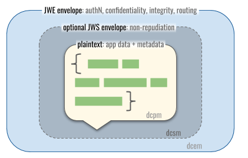

## Message Types

This spec discusses messages in three different formats. The casual phrase "DIDComm message" is ambiguous, but usually refers to DIDComm encrypted messages (the outermost box in the diagram below). These will constitute the vast majority of network traffic in most DIDComm deployments, and they are responsible for security guarantees in the system. However, the role of encrypted messages cannot be understood without reference to the simpler formats they contain.



### DIDComm Plaintext Messages

A DIDComm message in its plaintext form, not packaged into any protective envelope, is known as a **DIDComm plaintext message**. Plaintext messages lack confidentiality and integrity guarantees, and are repudiable. They are therefore not normally transported across security boundaries. However, this may be a helpful format to inspect in debuggers, since it exposes underlying semantics, and it is the format used in this spec to give examples of headers and other internals. Depending on ambient security, plaintext may or may not be an appropriate format for DIDComm data at rest.

When higher-level protocols are built atop DIDComm, applications remove the protective envelope(s) and process the plaintext that's inside. Specs for higher-level protocols typically document message structure and provide examples in this format; protective envelopes are assumed but ignored as a low-level detail.

Applications running one or more DIDComm-based protocols may wish to define their own media types for the protocols they support. Absent such customization, the preferred media type for a generic DIDComm plaintext message SHOULD be `application/didcomm-plain+json`. This correctly conveys the fact that code handling such content functions at a different level from DIDComm's security and routing, and that generic JSON tools and actions are likely to be a helpful fallback in processing the content.

DIDComm plaintext messages are also correctly understood as JWM content (see [Plaintext Message Structure](#plaintext-message-structure), below). Thus a media type for JWMs MIGHT be an accurate but more generic way to categorize them. However, not all JWMs are DIDComm messages, so this categorization is suboptimal. Similarly, `application/json` is true, but overly generic and therefore not recommended.

When persisted as a file or attached as a payload in other contexts, the file extension for DIDComm plaintext messages SHOULD be `dcpm`, giving a globbing pattern of `*.dcpm`; this SHOULD be be read as "Star Dot D C P M" or as "D C P M" files. We imagine people will reference this media type by saying, "I am looking at a DIDComm Plaintext Message file", or "This database record is in DIDComm Plaintext format", or "Does my editor have a DIDComm Plaintext Message plugin?" A possible icon for this file format depicts green JSON text in a message bubble ([svg](collateral/dcpm.svg) | [256x256](collateral/dcpm-256.png) | [128x128](collateral/dcpm-128.png) | [64x64](collateral/dcpm-64.png)):


### DIDComm Signed Message

A **DIDComm signed message** is a JWS envelope that associates a non-repudiable signature with the plaintext message inside it.

Signed messages are not necessary to provide message integrity (tamper evidence), or to prove the sender to the recipient. Both of these guarantees automatically occur with the authenticated encryption in DIDComm encrypted messages. Signed messages are only necessary when the origin of plaintext must be provable to third parties, or when the sender can't be proven to the recipient by authenticated encryption because the recipient is not known in advance (e.g., in a broadcast scenario). Adding a signature when one is not needed [can degrade rather than enhance security because it relinquishes the sender's ability to speak off the record](https://github.com/hyperledger/aries-rfcs/blob/master/concepts/0049-repudiation/README.md#summary). We therefore expect signed messages to be used in a few cases, but not as a matter of course.

When a message is *both* signed and encrypted, the plaintext is signed, and then the signed envelope is encrypted. The opposite order is not used, since it would imply that the signer committed to opaque data (which is unsafe and undermines non-repudiation).

The [media type](https://tools.ietf.org/html/rfc6838) of a DIDComm signed message SHOULD be `application/didcomm-signed+json`.

Because a DIDComm signed message is also a JWS, a true but less specific media type MIGHT be `application/jose`. (Although `application/jwt` is a registered media type, `application/jwe` and `application/jws` [are not](https://tools.ietf.org/html/rfc7516#section-9). This is [deliberate](https://mailarchive.ietf.org/arch/msg/jose/FRTPwiOLOc5DILfY_QFZyemn9VU/).) Using the more generic type is not recommended, as content categorized in this way is unlikely to get the DIDComm-specific handling it needs. Similarly, it is also true but overly generic and therefore not recommended to describe a DIDComm signed message as `application/json`.

When persisted as a file or attached as a payload in other contexts, the file extension for DIDComm signed messages SHOULD be `dcsm`, giving a globbing pattern of `*.dcsm`; this SHOULD be be read as "Star Dot D C S M" or as "D C S M" files. A possible icon for this media type depicts a signed envelope ([svg](collateral/dcsm.svg) | [256x256](collateral/dcsm-256.png) | [128x128](collateral/dcsm-128.png) | [64x64](collateral/dcsm-64.png)):


### DIDComm Encrypted Message

A **DIDComm encrypted message** hides its content from all but authorized recipients, discloses and proves the sender to exactly and only those recipients, and provides integrity guarantees. It is important in privacy-preserving routing. It is what normally moves over network transports in DIDComm applications, and is the safest format for storing DIDComm data at rest.
 
 The [media type](https://tools.ietf.org/html/rfc6838) of a DIDComm encrypted message SHOULD be `application/didcomm-encrypted+json`.

>Note: If future versions of this spec allow binary encodings, variations like `application/didcomm-encrypted+cbor` (see [CBOR RFC 7049, section 7.5](https://tools.ietf.org/html/rfc7049#section-7.5)), `application/didcomm-encrypted+msgpack`, or `application/didcomm-encrypted+protobuf` may become reasonable. Future DIDComm specs that encompass comm patterns other than messaging &mdash; DIDComm multicast or DIDComm streaming, for example &mdash; might use a suffix: `application/didcomm-encrypted-multicast` or similar.

Because a DIDComm encrypted message is also a JWE, a true but less specific media type MIGHT be `application/jose`. Note how this overlaps with the generic media type of the JWS of a DIDComm Signed Message. As with DIDComm signed Messages, using more generic media types is ambiguous and not recommended.

When persisted as a file or attached as a payload in other contexts, the file extension for DIDComm encrypted messages SHOULD be `dcem`, giving a globbing pattern of `*.dcem`; this SHOULD be be read as "Star Dot D C E M" or as "D C E M" files. A possible icon for this file format depicts an envelope with binary overlay, protected by a lock ([svg](collateral/dcem.svg) | [256x256](collateral/dcem-256.png) | [128x128](collateral/dcem-128.png) | [64x64](collateral/dcem-64.png)):


## Plaintext Message Structure

DIDComm plaintext messages are based on [JWM (JSON Web Messages)](https://tools.ietf.org/html/draft-looker-jwm-01). A message has a basic structure that specifies the message type, id, and other attributes common to all messages. These common attributes appear at the top level of a DIDComm message, and are called headers. A message also includes attributes specific to the message type. Type specific message attributes are contained within the `body` attribute of a message.

Prior to being sent to a recipient, the JWM is usually encrypted into a JWE according to the JWM spec.

The following example shows common elements of a plaintext message. Further details and advanced usage are covered elsewhere in this spec.

```json
{
    "id": "1234567890",
    "type": "<message-type-uri>",
    "from": "did:example:alice",
    "to": ["did:example:bob"],
    "created_time": 1516269022,
    "expires_time": 1516385931,
    "body": {
    	"messagespecificattribute": "and it's value"
	}
}
```

### Message Headers

The predefined attributes of a DIDComm Message at the level of its outer packaging (effectively, the "headers" of the message) are as follows:

- **id** - REQUIRED. Message ID. The `id` attribute value MUST be unique to the sender.
- **type** - REQUIRED. Message Type. The `type` attribute value MUST be a valid [Message Type URI](protocols.md#message-type-uri) , that when resolved gives human readable information about the message. The attributes value also informs the content of the message, for example the presence of other attributes and how they should be processed.
- **to** - OPTIONAL. Recipient(s) identifier. The `to` attribute MUST be an array of strings where each element is a valid [DID URL](https://w3c.github.io/did-core/#did-url-syntax) without the [Fragment component](https://w3c.github.io/did-core/#fragment) which identifies the recipients of the message.
- **from** - OPTIONAL. Sender identifier. The `from` attribute MUST be a string that is a valid [DID URL](https://w3c.github.io/did-core/#did-url-syntax) without the [Fragment component](https://w3c.github.io/did-core/#fragment) which identifies the sender of the message. When a message is encrypted, the sender key MUST be authorized for encryption by this DID. Authorization of the encryption key for this DID MUST be verified by message recipient with the proper proof purposes. See the [message authentication](#Message-Authentication) section for additional details.
- **created_time** - OPTIONAL. Message Created Time. The `created_time` attribute is used for the sender to express when they created the message, expressed in UTC Epoch Seconds (seconds since 1970-01-01T00:00:00Z UTC) [link](1970-01-01T00:00:00Z UTC). This attribute is informative to the recipient, and may be relied on by protocols.
- **expires_time** - OPTIONAL. Message Expired Time. The `expires_time` attribute is used for the sender to express when they consider the message to be expired, expressed in UTC Epoch Seconds (seconds since 1970-01-01T00:00:00Z UTC) [link](1970-01-01T00:00:00Z UTC). This attribute signals when the message is no longer valid, and is to be used by the recipient to discard expired messages on receipt.

In the outer packaging of message metadata, DIDComm follows the extensibility pattern established by the JW* family of standards. (It also emulates the design of message headers in SMTP, request headers in HTTP, and labels on physical pieces of mail.) A modest inventory of predefined "header" fields is specified, as shown above. Additional fields with unreserved names can be added at the discretion of producers and consumers of messages; any software that doesn't understand such fields should ignore them and MUST NOT fail because of their inclusion in a message. This is appropriate for a simple, flat data model.

Aligning with [RFC 6648](https://tools.ietf.org/html/rfc6648.html), DIDComm explicitly rejects the `X-*` headers convention that creates divergent pseudo-standards; if a new header needs broad support, it must be standardized properly. Alternatively, a JSON-LD `@context` header can be added, providing namespacing for fields other than those predefined in the spec. Since we expect header fields to be small in number and modest in complexity, we expect this sort of powerful extensibility to be unnecessary in most cases.

#### Simple vs. Structured

Headers can be simple (mapping a header name to an integer or a string) or structured (mapping a header name to JSON substructure -- an array or JSON object). When defining a new header type, the following guidelines apply:

* Headers SHOULD NOT use more structure than necessary; simple headers are preferred.
* However, a header value SHOULD NOT require interpretation over and above ordinary JSON parsing. Prefer JSON structure to specialized string DSLs like the one that encodes media type preferences in an HTTP `Accept` header. ([HTTP Structured Headers](https://tools.ietf.org/html/draft-ietf-httpbis-header-structure-15) provide similar functionality but are unnecessary here, since DIDComm plaintext already has an easily parseable syntax.)
* Headers that are only meaningful together SHOULD be grouped into a JSON object.

#### Relationship to JSON-LD

The problem domain of DIDComm intersects with other aspects of decentralized identity, where JSON-LD plays a role in some standards. Thus it may be natural to wonder about DIDComm's relationship to JSON-LD and to the rich semantics and extensibility features it offers. The short answer is that DIDComm is not dependent on JSON-LD, but it is compatible with it. We expect these two technologies to remain mostly orthogonal.

The body of a message -- everything inside the `body` object -- is different. Here, there is substantial variety and complexity. Structures may be sophisticated graphs, represented with nested objects and arrays. JSON-LD is not required at this level, either. However, it is available, and may be appropriate for certain use cases where extensibility is an important feature. JSON-LD usage, if it occurs, SHOULD be a declared feature of a protocol as a whole, not an ad hoc extension to arbitrary individual messages, and MUST be signalled by the inclusion of a `@context` inside `body`. Unless a protocol declares a JSON-LD dependency, the same rules apply to JSON-LD-isms as apply to any other unrecognized structure in a DIDComm message: additional fields can be added to any part of message structure, should be ignored if not understood, and MUST NOT be the basis of failure by recipients.

### DID Rotation

DIDComm is based on DIDs and their associated DID Documents. Changes to keys and endpoints are the concern of each DID method and are utilized but not managed by DIDComm. DID Rotation serves a very specific and narrow need to switch from one DID method to another. This is very common at the beginning of a new DIDComm relationship when a public DID or a temporary DID passed unencrypted is rotated out for a DID chosen for the relationship. As rotation between one DID and another is outside the scope of any DID method, the details of DID Rotation are handled within DIDComm itself.

When a DID is rotated, the new DID is put into immediate use encrypting the message, and one additional attribute is included as a message header:

- **from_prior**: A JWT, with with `sub`: new DID and `iss`: prior DID, with a signature from a key authorized by prior DID.

When a message is received from an unknown DID, the recipient should check for existence of the `from_prior` header. The JWT in the`from_prior` attribute is used to extract the prior DID (`iss`) and is checked to verify the validity of the rotation. The recipient then associates the message with context related to the known sender. The new DID and associated DID Document information should be used for further communication.

The validity of the DID rotation is verified by checking the JWT signature against the key indicated in the `kid` header parameter. The indicated key MUST be authorized in the DID Document of the prior DID (`iss`).

The `from_prior` attribute should be included in messages sent until the party rotating receives a message sent to the new DID. If multiple messages are received to containing the rotation headers after being processed by the recipient, they may be ignored.

#### JWT Details

The JWT is constructed as follows, with appropriate values changed.

**Header**:

```json
{
  "typ": "JWT",
  "alg": "EdDSA",
  "crv": "ED25519",
  "kid": "<key id authorized in prior DID>"
}
```

**Payload**:

```jsonc
{
  "sub": "<new DID URI>",
  "iss": "<prior DID URI>",
  "iat": 1516239022 //datetime of the rotation, not message
}
```

#### Example Message Rotating DID

```json
{
    "id": "1234567890",
    "type": "<message-type-uri>",
    "from": "did:example:alice2",
    "from_prior": "<JWT with sub:did:example:alice2 and iss:did:example:alice>",
    "to": ["did:example:bob"],
    "created_time": 1516269022,
    "expires_time": 1516385931,
    "body": {
    	"messagespecificattribute": "and its value"
	}
}
```

#### Rotation Limitations

- This rotation method does not cover cases where a multi-sig is required. Rotations with such requirements should use a more expressive protocol.
- This rotation method only supports the case where a new DID is used, replacing an old DID which is no longer used. Adjustments to DIDs used between different parties that does not fit this narrow use should use a more expressive protocol.
